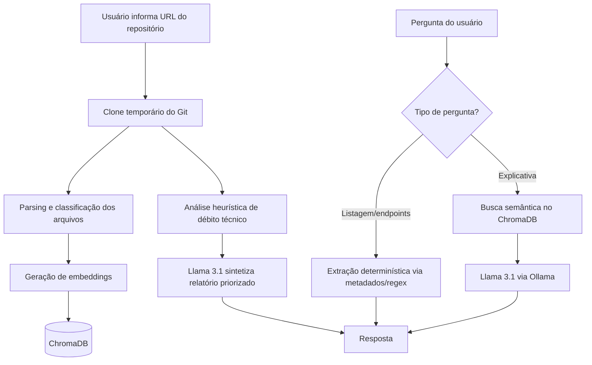

<div align="center">

# Legacy Code Explainer

### IA local que entende sistemas Java Spring Boot legados — e ajuda a modernizá-los

[](https://www.python.org/)
[](https://fastapi.tiangolo.com/)
[](https://ollama.com/)
[](https://www.trychroma.com/)
[]()

**[Demo](#-demonstração) · [Como funciona](#-como-funciona) · [Rodar localmente](#-rodando-localmente) · [Roadmap](#-roadmap)**

</div>

---

## 💡 O problema

Toda empresa com mais de alguns anos de vida tem um sistema legado que **ninguém quer mexer**:
documentação desatualizada (quando existe), desenvolvedores originais que já saíram, e um
medo constante de "quebrar algo" a cada mudança.

Entender esse tipo de sistema hoje significa ler código manualmente, cruzar dependências na
mão e torcer para não ter esquecido nada. Isso custa **dias ou semanas** em qualquer projeto
de manutenção, onboarding ou modernização.

## ✅ A solução

O **Legacy Code Explainer** aponta para um repositório Java Spring Boot e permite:

- 💬 Perguntar em português, em linguagem natural, como funciona qualquer parte do sistema
- 📋 Listar controllers, services, repositories e **endpoints reais** com confiabilidade total (não é "achismo" de IA — é extração direta das anotações Spring)
- 🔍 Rodar uma **análise automática de débito técnico**, priorizada por severidade, com recomendações objetivas de modernização

Tudo isso **100% local** — o código nunca sai da sua máquina. Não usa OpenAI, não usa nenhuma
API externa: roda com Llama 3.1 via Ollama, direto no seu hardware.

> Isso não é um "ChatGPT com prompt bonito". É uma arquitetura de RAG que entende metadados
> estruturais do código (tipo de classe, pacote, anotações) e decide dinamicamente a melhor
> estratégia de resposta — busca semântica, extração determinística ou análise heurística —
> dependendo do que foi perguntado.

---

## 🎥 Demonstração

> *(Aqui entra um GIF ou vídeo curto mostrando: colar a URL → indexar → perguntar algo →
> rodar a análise. Isso vale muito mais que qualquer print — grave com o
> [ScreenToGif](https://www.screentogif.com/) ou similar.)*


---

## ⚙️ Como funciona



**Decisão de design que vale destacar**: nem toda pergunta deveria passar por busca semântica.
Perguntas como *"quais endpoints existem?"* têm resposta **exata e verificável** — então o
sistema detecta esse tipo de intenção e responde direto pelos metadados extraídos do código,
eliminando o risco de alucinação do LLM em respostas que deveriam ser 100% determinísticas.

---

## 🚀 Funcionalidades

| Funcionalidade | Descrição |
|---|---|
| 🔗 Indexação automática | Cola a URL de qualquer repo Java Spring Boot e o sistema clona, lê e indexa sozinho |
| 💬 Chat sobre o código | Perguntas livres sobre arquitetura e fluxos, respondidas via RAG semântico |
| 📋 Listagens confiáveis | Controllers, services, repositories e endpoints reais — extraídos, não "adivinhados" |
| 🔍 Análise de débito técnico | Detecta god classes, lógica no lugar errado, tratamento de erro fraco, acoplamento excessivo, falta de testes, entre outros |
| 🧹 Zero resíduo em disco | Repositórios são clonados em pasta temporária do SO e removidos automaticamente após o uso |
| 🖥️ Frontend integrado | Interface web servida junto com a API — um único comando para rodar tudo |
| 🔒 100% local | Nenhum código enviado a APIs externas — roda com LLM local via Ollama |

---

## 🛠️ Stack técnica

| Camada | Tecnologia | Por quê |
|---|---|---|
| Backend | **Python + FastAPI** | API assíncrona, tipagem com Pydantic, documentação automática |
| LLM | **Ollama + Llama 3.1 8B** | Inferência local, sem custo de API, sem enviar código pra fora |
| Embeddings | **sentence-transformers** (`all-MiniLM-L6-v2`) | Leve, rápido, roda em CPU |
| Banco vetorial | **ChromaDB** | Persistência local simples, sem infraestrutura extra |
| Clone de repositórios | **GitPython** | Automação de clone/limpeza direto em Python |
| Frontend | **HTML/CSS/JS puro** | Zero dependência de build, servido direto pelo FastAPI |

---

## 📦 Rodando localmente

### Pré-requisitos
- Python 3.10+
- [Git](https://git-scm.com/downloads)
- [Ollama](https://ollama.com/download)

### Setup

```bash
python -m venv venv
# Windows: .\venv\Scripts\Activate.ps1
# Linux/Mac: source venv/bin/activate

pip install -r requirements.txt
ollama pull llama3.1:8b
```

### Rodar

```bash
uvicorn src.api.main:app --reload
```

Acesse **http://localhost:8000** — cole a URL de um repositório (ex:
[`spring-petclinic`](https://github.com/spring-projects/spring-petclinic)) e comece a explorar.

---

## 📁 Estrutura do projeto

```
legacy-code-explainer/
├── static/                 # frontend (HTML/CSS/JS)
├── src/
│   ├── api/                # rotas FastAPI
│   ├── parser/              # clone, varredura e classificação de arquivos
│   ├── embeddings/           # geração de embeddings
│   ├── retrieval/             # armazenamento/busca no ChromaDB
│   ├── analysis/               # heurísticas de detecção de débito técnico
│   ├── rag/                     # orquestração RAG + integração com Ollama
│   ├── graph/                     # (planejado) grafo de dependências via Tree-sitter
│   └── documentation/              # (planejado) geração automática de docs
├── requirements.txt
└── README.md
```

---

## 🗺️ Roadmap

- [x] RAG funcional com Ollama + ChromaDB
- [x] Listagem determinística de controllers/services/endpoints
- [x] Análise automática de débito técnico com priorização por severidade
- [x] Frontend web integrado, zero configuração
- [x] Limpeza automática de repositórios clonados (zero resíduo em disco)
- [ ] Grafo de dependências real via **Tree-sitter** (chamadas entre métodos, injeções de dependência)
- [ ] Análise de impacto — *"o que quebra se eu alterar esta classe?"*
- [ ] Geração automática de documentação (README + diagramas Mermaid)
- [ ] Extensão de IDE (IntelliJ) para uso em tempo real durante o desenvolvimento

---

## 🎯 O que este projeto demonstra

- Arquitetura de **RAG além do básico**: roteamento de intenção antes da busca, combinando
  respostas determinísticas e semânticas conforme o tipo de pergunta
- Uso de **LLM local** como decisão de arquitetura consciente (privacidade, custo zero de API)
- Análise estática de código com heurísticas próprias, sem depender só do LLM para julgamento
- Preocupação com **operação limpa**: gerenciamento de recursos temporários, tratamento de
  erros específicos de sistema operacional (permissões no Windows/Git)
- Projeto pensado em fases (MVP → estrutura → fluxos → impacto → documentação), com roadmap
  claro de evolução

---

## 📄 Licença

MIT — sinta-se livre para usar, estudar e evoluir este projeto.

---

<div align="center">

</div>
